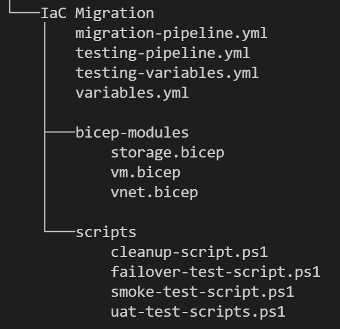

# Milestone: Redeployment/Rehosting of Migration Waves

#### [prev](./devops-iac-redeployment.md) | [home](./welcome.md)  | [next](./devops-iac-testing.md)
 
This section outlines the steps needed in order to execute an Azure DevOps Pipeline with the appropriate tasks needed for VM Redeployment/Rehosting.

[Infrastructure as Code Guidance](https://github.com/Azure/fta-live-iac#what-is-infrastructure-as-code)

## 1 Pre-Requisites
### 1.1\. Gather VM information from the Migration Discovery (using CSV generated from the discovery as a reference) to setup a `variables.yml` for pipeline execution. Ensure that the capacity planning is accurate for these resources.

## 2 Redeployment/Rehosting Tools - Planning and Implementation
### 2.1\. Create a project in Azure DevOps using guidance from the [DevOps/IaC Template](.\importing-template.md). This project template gives a baseline for getting started with planning and tracking migration tasks using [Azure Boards](https://docs.microsoft.com/en-us/azure/devops/boards/get-started/?view=azure-devops) and executing this migration path with [Azure Repos](https://docs.microsoft.com/en-us/azure/devops/repos/get-started/?view=azure-devops). In addition to this guidance, there are also sample [Azure Pipelines](https://docs.microsoft.com/en-us/azure/devops/pipelines/get-started/pipelines-get-started?view=azure-devops) templates in this repo that can be used as a baseline for your migration pipelines. 

### 2.2\. In the Azure DevOps Project Settings, allocate the appropriate permissions for users and Service Principals using least privilege. Also, create a service connection to use within your Azure DevOps environment for deployment purposes.

### 2.3\. Create the appropriate repository for template storage and version control using guidance outlined below:

Recommended folder structure:
 
 

Details:
- `bicep-modules`: folder to store bicep files in for reference
- `scripts`: folder to store powershell files for executing different test and validation scripts
    > Note: Test scripts to be developed (recommend using PowerShell) based on needs for your migration environment.
- `testing-pipeline.yml`: file for testing in an isolated VNet
- `migration-pipeline.yml`: file for running non-prod and prod migration waves

### 2.3\. Create IaC templates for your deployment
If utilizing Bicep for your deployment, start [here](https://github.com/Azure/fta-live-iac#bicep) for a list of resources for getting started with Bicep and integrating it into an Azure DevOps Pipeline.

- Set up any components such as a Shared Image Gallery with custom images
    - [Shared Image Gallery Documentation](https://docs.microsoft.com/en-us/azure/virtual-machines/shared-image-galleries)
    - [Azure Image Builder Documentation](https://docs.microsoft.com/en-us/azure/virtual-machines/image-builder-overview)
    - [DevOps Task for Azure Image Builder](https://docs.microsoft.com/en-us/azure/virtual-machines/linux/image-builder-devops-task)
-  Create compute, network and storage templates for execution

## 3 Pipeline Execution for Rehost/Redeployment
This section covers utilizing Azure Pipelines to execute IaC templates. The recommendation is to separate the pipelines based on environment (test, non-prod and prod pipelines) through use of branches on a starter pipeline. The trigger for the environment would act as the indicator for which environment to execute.

> Note: Guidance for utilizing 3rd Party Orchestration Engines (Optional) can be found [here](https://github.com/Azure/fta-live-iac#other-orchestrators)

### 3.1\. Based on the migration wave, outline variables needed for the CI/CD pipeline in a [variables.yml](./pipelines/variables.yml) file.

### 3.2\. Create a pipeline.yml for resource execution using the [template](./pipelines/migration-pipeline.yml) as a starter pipeline. Below are the environment-based Pipeline components descriptions:
- Test
    - Testing scripts
    - Isolated VNet used to test and validate VMs
- Non-Prod
    -  Non-Production Migration Wave Workload
- Prod
    - Production Migration Wave Workload

### 3.3\. Execute the pipeline for the appropriate migration wave and environment.

