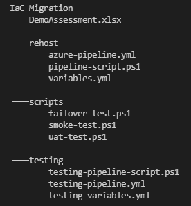

# Milestone: Redeployment/Rehosting of Migration Waves

#### [prev](./devops-iac-redeployment.md) | [home](./welcome.md)  | [next](./devops-iac-testing.md)
 
This section outlines the steps needed in order to execute an Azure DevOps Pipeline with the appropriate tasks needed for VM Redeployment/Rehosting.

[Infrastructure as Code Guidance](https://github.com/Azure/fta-live-iac#what-is-infrastructure-as-code)

## 1 Pre-Requisites

### 1.1\. Convert Azure Migrate Assessment sheets from xlsx to CSVs using the [provided PowerShell script](../pipelines/convert-xlsx-to-csv.ps1). The expected output is 2 CSV sheets from the assessments: `All_Assessed_Machines.csv` and `All_Assessed_Disks.csv`.

### 1.2\. Gather VM information from the Migration Discovery (using CSV generated from the discovery as a reference) to setup a `variables.yml` for pipeline execution. Ensure that the capacity planning is accurate for these resources.

## 2 Redeployment/Rehosting Tools - Planning and Implementation

### 2.1\. Create a project in Azure DevOps using guidance from the [DevOps/IaC Template](./importing-template.md). This project template gives a baseline for getting started with planning and tracking migration tasks using [Azure Boards](https://docs.microsoft.com/en-us/azure/devops/boards/get-started/?view=azure-devops) and executing this migration path with [Azure Repos](https://docs.microsoft.com/en-us/azure/devops/repos/get-started/?view=azure-devops). In addition to this guidance, there are also sample [Azure Pipelines](https://docs.microsoft.com/en-us/azure/devops/pipelines/get-started/pipelines-get-started?view=azure-devops) templates in this repo that can be used as a baseline for your migration pipelines. 

### 2.2\. In the Azure DevOps Project Settings, allocate the appropriate permissions for users and Service Principals using least privilege principles. Also, create a service connection to use within your Azure DevOps environment for resource deployment purposes.

### 2.3\. Create the appropriate repository for scripts storage, CSV files and version control using guidance outlined below:

Recommended folder structure:
 
 

Details:
- `All_Assessed_Machines.csv` and `All_Assessed_Disks.csv`: CSV files extracted from Azure Migrate Assessement excel file
- `scripts`: folder to store powershell files for executing different test and validation scripts
    > Note: Test scripts are to be developed based on needs for your migration environment. (Recommend developing them in PowerShell)
- `azure-pipeline.yml`: file for testing in an isolated VNet
- `variables.yml`: variables used in powershell and pipeline yaml

## 3 Pipeline Execution for Rehost/Redeployment
This section covers utilizing Azure Pipelines to execute IaC templates. The recommendation is to separate the pipelines based on environment (test, non-prod and prod pipelines) through use of branches on a starter pipeline. The trigger for the environment would act as the indicator for which environment to execute.

> Note: Guidance for utilizing 3rd Party Orchestration Engines (Optional) can be found [here](https://github.com/Azure/fta-live-iac#other-orchestrators)

### 3.1\. Based on the migration wave, outline variables needed for the CI/CD pipeline in a [variables.yml](../pipelines/variables.yml) file.

### 3.2\. Create a [`pipeline.yml`](..\pipelines\azure-pipeline.yml) for resource execution using the templates as a starter pipeline.

### 3.3\. Execute the pipeline for the appropriate migration wave and environment.

